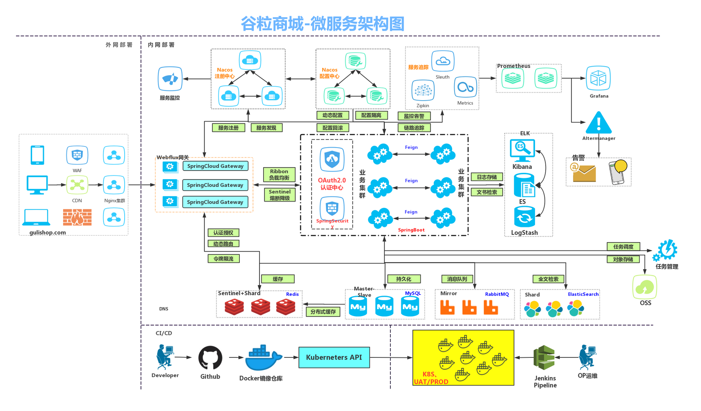
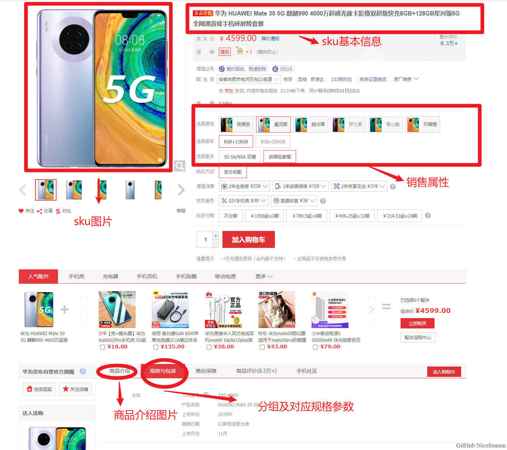
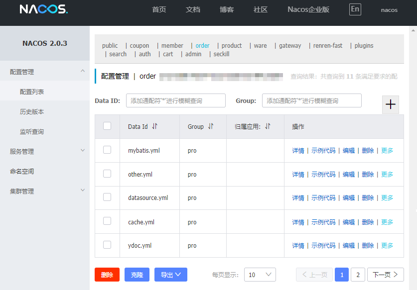
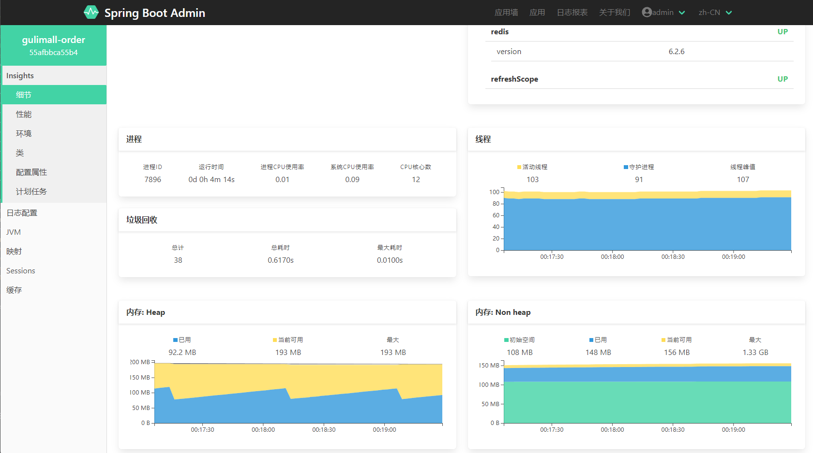
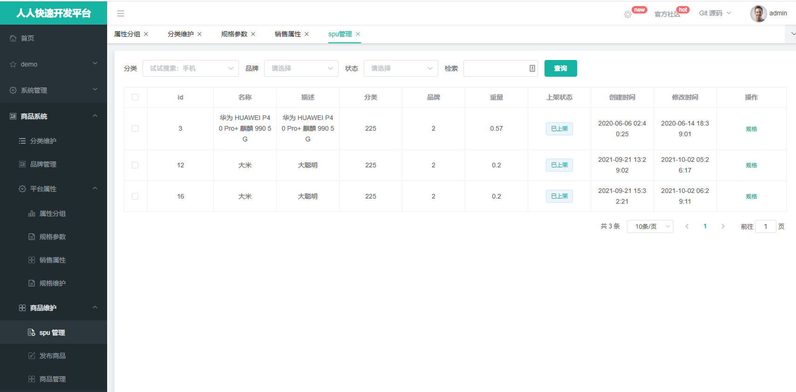
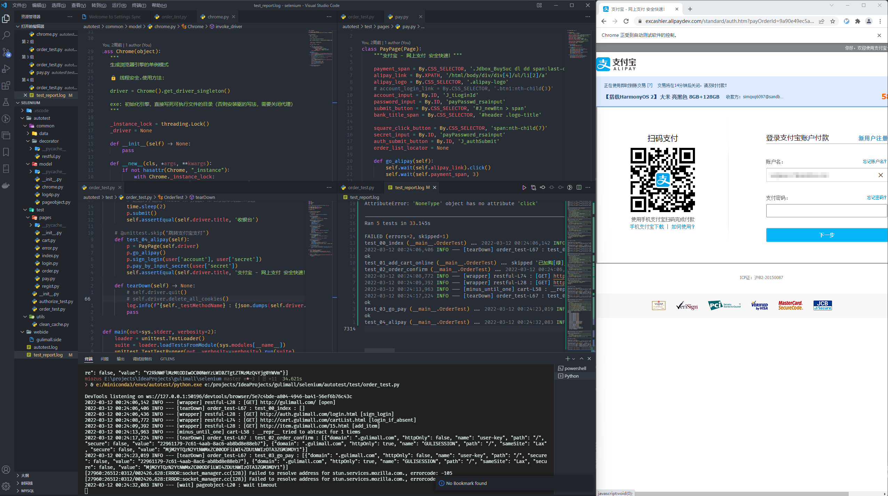
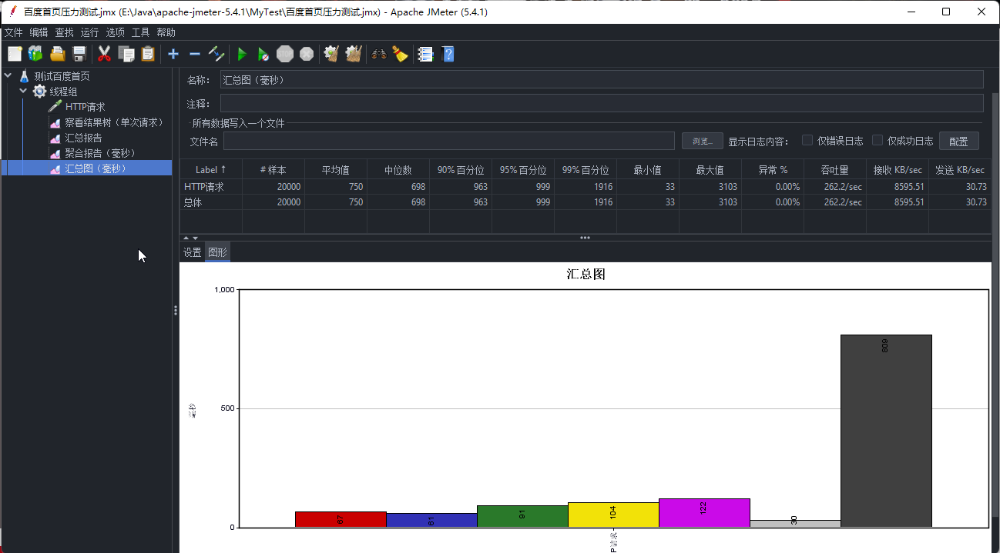
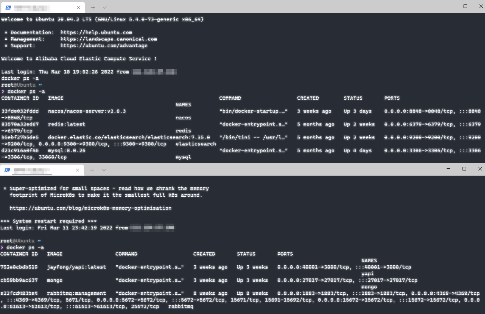

# 谷粒商城

All my effCort is the parody of JD.COM since 2019.

仿京东商城 2019

---



接口文档：https://easydoc.xyz/s/78237135/ZUqEdvA4/hKJTcbfd

视频链接：https://www.bilibili.com/video/BV1np4y1C7Yf?from=search&seid=8989733132604162058

## 项目简介

仿 2019 年京东商城，基于 SpringCloud 微服务架构和 MVC 模式开发的电商系统。完成了商家后台管理商品上架，菜单分类，用户注册和登录，搜索商品、下单购物，支付宝付款等一条龙服务。
拆分成多种类型微服务（按相似技术栈分类）：

| 序号   | 微服务       | 技术栈                                                           | 备注                        |
|------|-----------|---------------------------------------------------------------|---------------------------|
| 1    | 订单、购物车    | Redis 分布式缓存、锁、幂等性校验，RabbitMQ 消息队列                             |  | 
| 1    | 搜索        | ElasticSearch 检索                                              |         | 
| 1    | 会员        | SpringWeb 拦截器 + JWT鉴权、Oauth2.0 第三方授权                          |      |
| 1    | 商品、库存、优惠券 | MySQL 数据库、MyBatisPlus 持久层框架等                                  |      |
| 1    | 路由、发现中心   | Alibaba-Nacos 注册中心和配置中心、OpenFeign 微服务通信、SpringBoot-Gateway 路由 |    |
| 1    | 第三方       | oss 图床、短信验证                                                   |                           |

基础服务设施（技术栈）还有：

| 序号  | 基础设施 | 技术栈                                                                                        | 备注                                       |
|-----|-----------|---------------------------------------------------------------|---------------------------|
| 1   | 通用 | Thymeleaf 页面渲染、Nginx 负载均衡、SpringCloud-Admin 微服务监控中心 |           |
| 1   | 后台 | Renren-fast、Renren-fast-vue 后台管理系统                                                         |              | 
| 1   | 测试 | Selenium（Python）单元测试                                                                       |                                        | 
| 1   | 压测调试 | JMeter 压力测试、VisualVM 健康检测、Arthas 线上诊断                                                      |                  | 
| 1   | 服务器 | Docker 部署中间件 |  | 

## 上线运维

数据库和中间件部署在阿里云服务器（1核2G），本机电脑运行所有的 SpringCloud 微服务实例（因此没有硬件支撑在线上查看项目，很抱歉），内存吃紧（5G），主要受网络时延和中间件影响，压力测试吞吐量 9 /s

ps.如果有钱买大内存的服务器，再多几台服务器集群，才能展现它的支撑高并发、高可用的能力（如果我有条件部署，我做压力测试了再放数据）

## 快速开始

具体参考教程视频或其他 Gulimall 开源笔记。

因为 Nacos 配置中心，管理每个微服务的配置，类多且繁杂，但好在持久化在一个数据库中。本人使用 2G*2 服务器内存太吃紧，所处这里不展开共享测试了。

ps.后续重构项目会将账号信息隐藏后，加上注解公开配置文件，并开源 Notion 笔记开发细节，手摸手教你实现从零到一完成电商系统。

## 技术重构

课程除了讲主流框架的使用场景的解决方案，以及演示基本的增删改查操作，在实现业务逻辑的细节上，观众弹幕评价褒贬不一。

本着简单实用（大道至简）原则，本人参考了一些商城开源项目的设计（如 yami-shop、renren-fast），以及 Java-Guide 关于 Spring
框架技术文章，强化代码自身表达能力，尝试从以下几个方向做了重构（这些都是超出课程，重构上瘾了）。

### 🍽️ Spring AOP 面向切面编程

1. **全局异常**：在底层实现尽管抛出，在上层控制层捕获。
    1. 它放在公共服务 common 下，基本异常、前端参数校验异常、商城服务自定义异常，这三类基本涵盖所有了。
    2. 商城服务自定义异常 GuliMallBindException ，包含了全局通用异常枚举类 BizCodeEnum

```java
/**
 * 默认异常处理程序配置
 */
@Controller
@RestControllerAdvice
public class DefaultExceptionHandlerConfig {


    @ExceptionHandler(BindException.class)
    public ResponseEntity<String> bindExceptionHandler(BindException e) {
        e.printStackTrace();
        return ResponseEntity.status(HttpStatus.BAD_REQUEST).body(e.getBindingResult().getFieldErrors().get(0).getDefaultMessage());

    }

    @ExceptionHandler(MethodArgumentNotValidException.class)
    public ResponseEntity<String> methodArgumentNotValidExceptionHandler(MethodArgumentNotValidException e) {
        e.printStackTrace();
        return ResponseEntity.status(HttpStatus.BAD_REQUEST).body(e.getBindingResult().getFieldErrors().get(0).getDefaultMessage());
    }

    @ExceptionHandler(GuliMallBindException.class)
    public ResponseEntity<String> unauthorizedExceptionHandler(GuliMallBindException e) {
        e.printStackTrace();
        return ResponseEntity.status(e.getBizCode()).body(e.getMessage());
    }
}
```

2. **缓存管理**：对缓存的增删改查、令牌校验、幂等性校验

```java

/**
 * Redis 购物车商品缓存切面
 */
@Aspect
@Component
@Order(1)
public class OrderRedisAspect {

    @Autowired
    StringRedisTemplate redisTemplate;

    private final String CART_PREFIX = "gulimall:cart:";


    @Around(value = "@annotation(idempotent)")
    public Object checkIdempotentRedisCache(ProceedingJoinPoint pjp, Idempotent idempotent) throws Throwable {
        OrderSubmitVo args = (OrderSubmitVo) pjp.getArgs()[0];
        Long execute = deleteKeyIfExistTokenRedis(args);
        if (execute == 0L) {
            throw new GuliMallBindException("令牌校验失败，请勿重复提交订单");
        }
        return pjp.proceed();
    }
    // ...
}
  ```

3. **消息队列**：分离额外推送，业务逻辑代码解耦

```java
/**
 * 订单消息队列切面
 */
@Aspect
@Component
@Order(2)
public class OrderRabbitMqAspect {

    @Lazy
    @Autowired
    RabbitTemplate rabbitTemplate;

    @AfterReturning(value = "@annotation(postRabbitMq)", returning = "retVal")
    public Object sendRabbitMq(JoinPoint point, Object retVal, PostRabbitMq postRabbitMq) {
        if (Objects.nonNull(retVal)) {
            // 创建订单：发送消息创建完成
            OrderEntity order = (OrderEntity) retVal;
            pushDelayQueueAfterSubmitOrder(order);
        } else {
            // 关闭订单：二次确认解锁库存
            OrderEntity methodArg = (OrderEntity) point.getArgs()[0];
            pushReleaseQueueAfterCancelOrderForSure(methodArg);
        }
        return retVal;
    }
    // ...
}

```

4. **系统日志**：审计重点函数执行时间、参数、返回值，并持久化。（仅单个微服务有效，跨服或需消息队列）

```java
/**
 * 系统日志切面
 */
@Component
@Aspect
@Slf4j
public class SysLogAspect {
//    @Autowired
//    private SysLogService sysLogService;

    @Around("@annotation(sysLog)")
    public Object around(ProceedingJoinPoint joinPoint, SysLog sysLog) throws Throwable {
        long beginTime = SystemClock.now();
        //执行方法
        Object result = joinPoint.proceed();
        //执行时长(毫秒)
        long time = SystemClock.now() - beginTime;

        SysLogTo sysLogTo = new SysLogTo();
        if (sysLog != null) {
            //注解上的描述
            sysLogTo.setOperation(sysLog.value());
        }

        //请求的方法名
        String className = joinPoint.getTarget().getClass().getName();
        String methodName = joinPoint.getSignature().getName();
        sysLogTo.setMethod(className + "." + methodName + "()");

        //请求的参数
        Object[] args = joinPoint.getArgs();
        String params = JSONUtil.toJsonStr(args[0]);
        sysLogTo.setParams(params);

        //设置IP地址
        sysLogTo.setIp(IpHelper.getIpAddr());
        //用户名：需要 Shiro 授权框架/Spring-Security 支持
//        String username = SecurityUtils.getSysUser().getUsername();
//        sysLogEntity.setUsername(username);
        sysLogTo.setTime(time);
        sysLogTo.setCreateDate(new Date());
        //保存系统日志
        log.info("sysLogEntity {} ", sysLogTo);
//        sysLogService.save(sysLogEntity);
        return result;
    }
}

```

### 🤖 Selenium 测试驱动开发

从零到一，搭建了测试框架。

- 设计模式
    - PO：面向页面，实现三层代码解耦合：元素选择器 + 浏览器引擎模板对象 + 单元测试编写用例
    - 单例：日志对象、浏览器对象必须只有1个，用的加锁双重校验保证多线程安全。（可惜复用浏览器上次对话还要搜集会话信息）
    - 装饰器: 封装了 URL 路由方法，一般点击操作需要先打开网页
    - 工厂：上述模型都封装模块，每次写新页面，直接调用组件;写测试用例，就调用页面、方法、数据。
- 结合浏览器插件熟悉测试流程：
    - 通过测试，发现和修复了文档标题、登录后应隐藏登录入口、Hystrix 熔断的隔离级别导致 Feign 通讯丢失请求头等问题
- 因为前后端数据都设计好了，Swagger 接口测试就不做了，接口文档参照上面的。（后期重构的话，准备使用 Apifox 工具 ）

其中装饰器模式，不就 AOP 的抽象嘛。（所以，语言不重要，解决问题方案才重要。）

```python
class mapping(object):

    def __init__(self):
    """ 不允许实例化 """
    return False

    @staticmethod
    def get(url):
        """ 
        打开网页，然后执行你的方法
        """
        if isinstance(url, Enum):
            url = url.value

        def decorator(func):
            @wraps(func)
            def wrapper(*args, **kwargs):
                if driver.current_url != url:
                    log.info(f'[GET] {url} [{func.__name__}]')
                    driver.get(url)
                return func(*args, **kwargs)

            return wrapper

        return decorator
```


